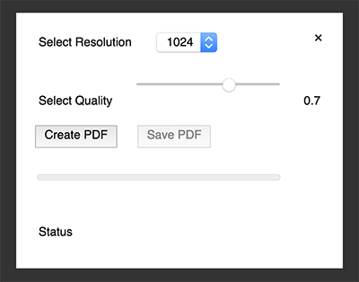

# iiif2pdf

This small Javascript widget implements client side rendering of PDFs from arbitrary IIIF sources. All it needs is a URL to a manifest file and the URI (@id) of a Sequence, Range or Canvas.

This widget uses [jsPDF](https://github.com/MrRio/jsPDF) and [jQuery](https://jquery.com/).

